ifndef::imagesdir[:imagesdir: ../images]

[[section-tests]]

== Tests

=== Pruebas unitarias

Para este proyecto decidimos realizar pruebas unitarias para cada servicio desarrollado y para cada componente de React en el frontend. Estas pruebas se llevan a cabo de manera obligatoria al realizar un commit en la rama principal del repositorio y al efectuar una release, lo que nos permite garantizar el correcto funcionamiento de la aplicación.

=== Pruebas de aceptación

Se hacen...

=== Pruebas de cobertura de código

El objetivo de las pruebas de cobertura establecido ha sido cubrir 80% de las líneas del código total.

A continuación, se muestra la cobertura de código obtenida en cada uno de los servicios desarrollados:

*API Service*

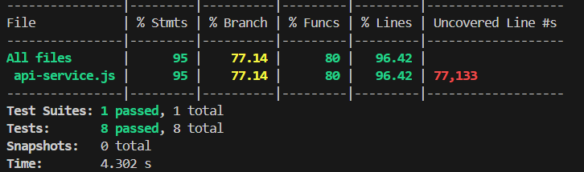

*Gateway Service*

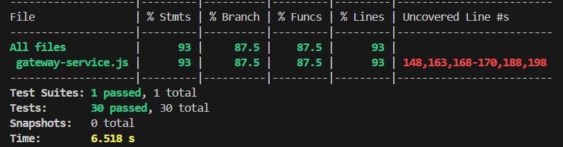

*LLM Service*

image::../images/12_testsCoverage_llm.png[]

*Multiplayer Service*

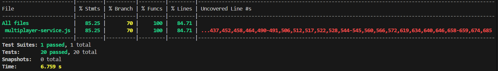

*Question Service*

image::../images/12_testsCoverage_question.png[]

*Authentication Service*

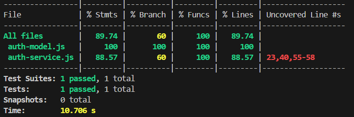

*Sesion Service*

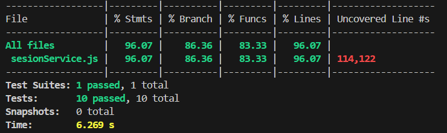

*Users Service*

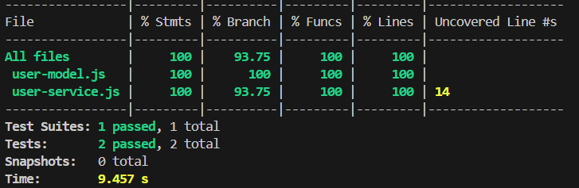

A continuación, se muestra la cobertura de código obtenida en cada uno de los componentes que forman la aplicación, almacenados en el directorio *webapp*:

*App*

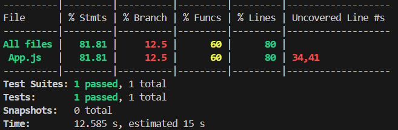

*AnimatedCharacter*

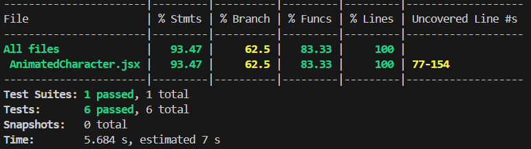

*Chatbot*

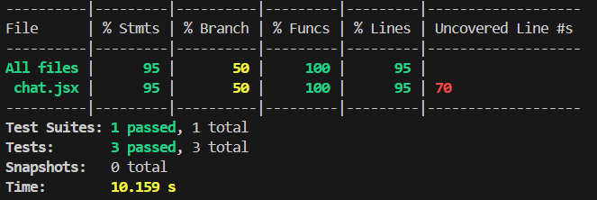

*Game*

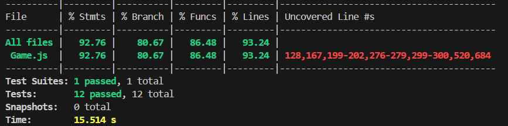

*Home*

image::../images/12_testsCoverage_webapp_home.png[]

*Login*

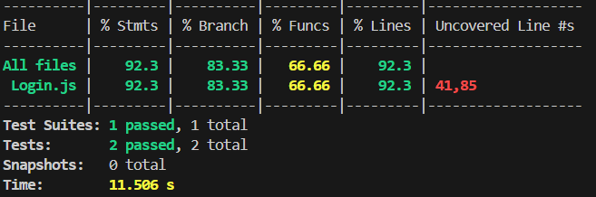

*Profile*

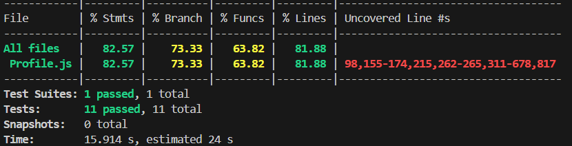

*AddUser*

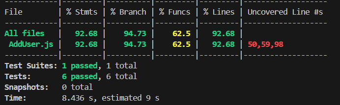

=== Pruebas de carga (load tests)

Se han realizado pruebas de carga a la aplicación. Estas pruebas se encargan de medir el rendimiento de la aplicación bajo condiciones específicas. En este caso, se han realizado pruebas de carga para medir el rendimiento de la aplicación en cuanto a la cantidad de usuarios concurrentes que pueden interactuar con ella al mismo tiempo.

Para las primeras pruebas se ha establecido el escenario de *3 usuarios por segundo, de forma constante, durante 15 segundos*, un total de 45 usuarios.

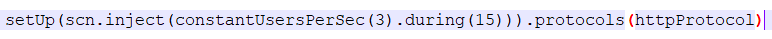

Para este escenario, se han obtenido los siguientes resultados en las diferentes simulaciones de los flujos de la aplicación.

*Cargar la aplicación*

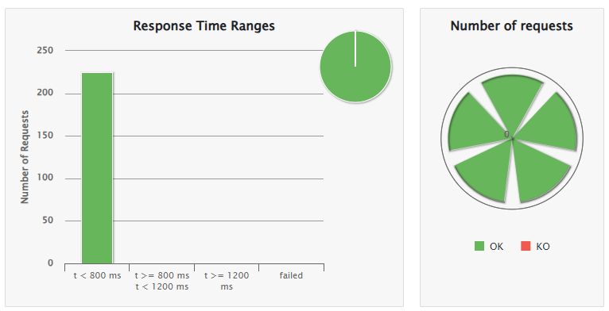
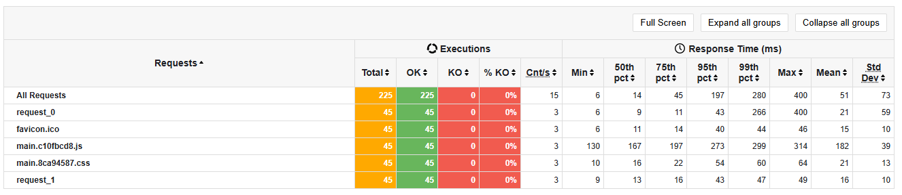

*Navegar por la aplicación*

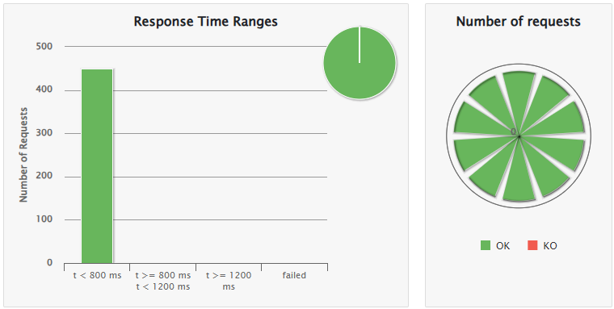
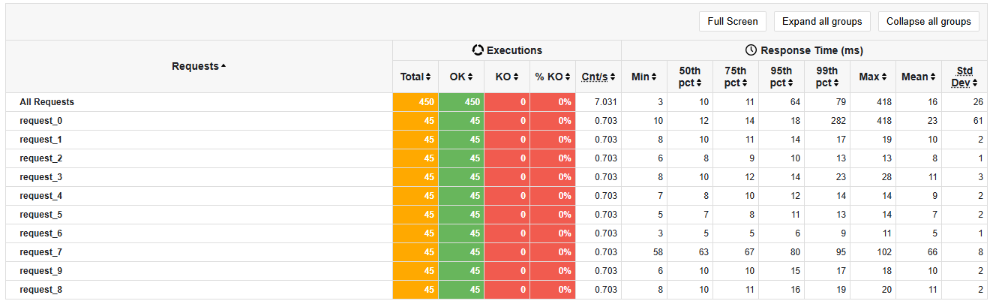

*Iniciar sesión en la aplicación*

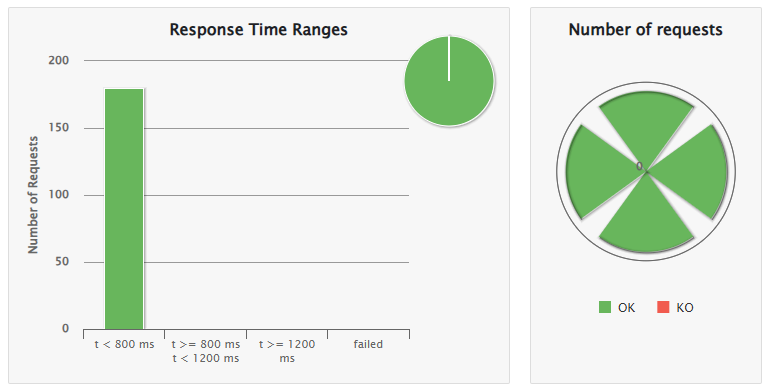
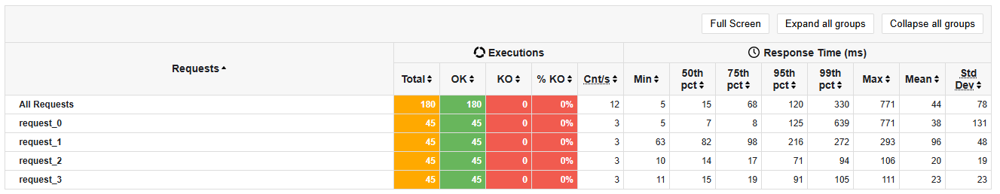

*Registrarse como nuevo usuario en la aplicación*

image::../images/12_load-tests_3usersper15seg_register.png[]
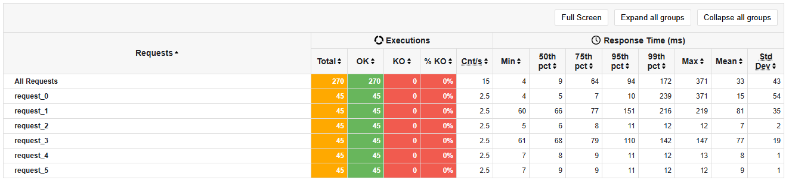

*Jugar una nueva partida completa*

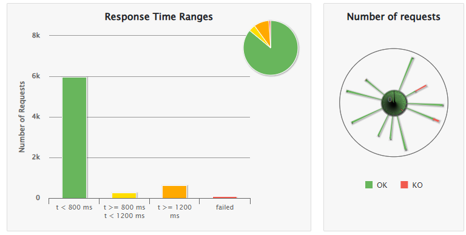
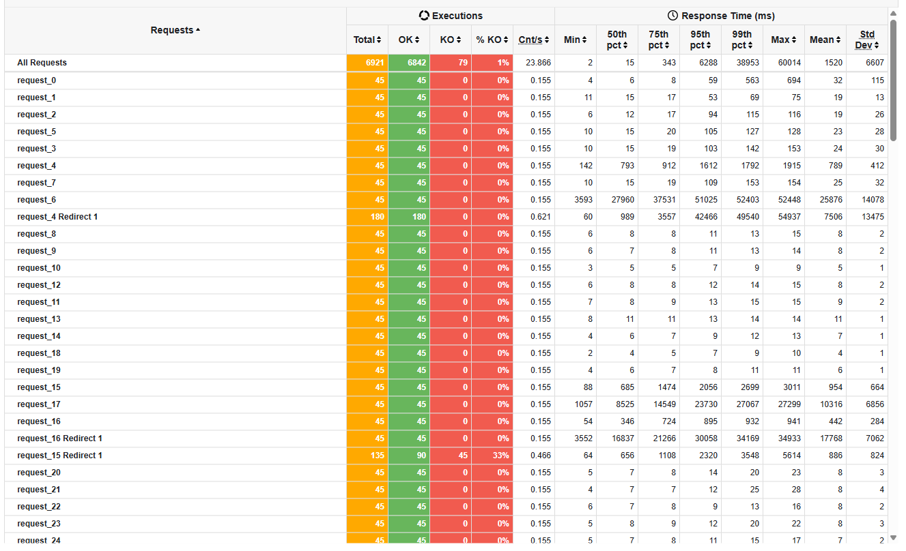
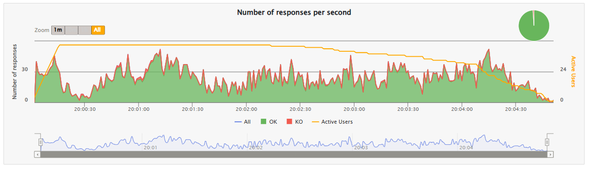

*Jugar una nueva partida usando el chatbot para obtener pistas*

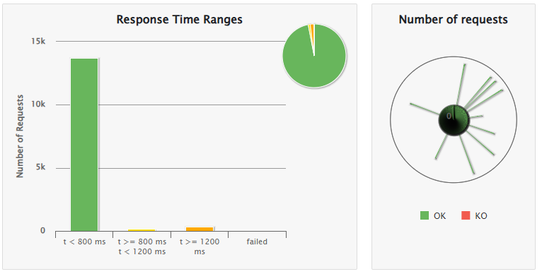
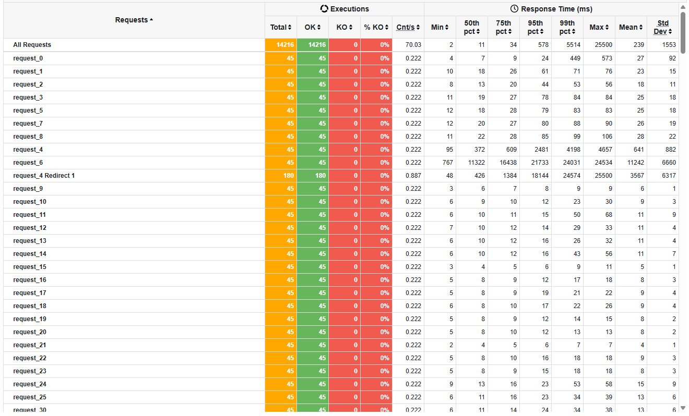
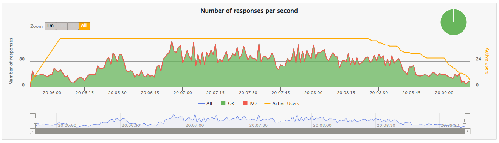

*Abandonar una partida ya iniciada*

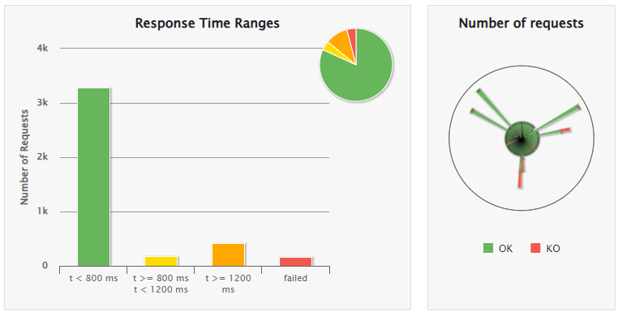
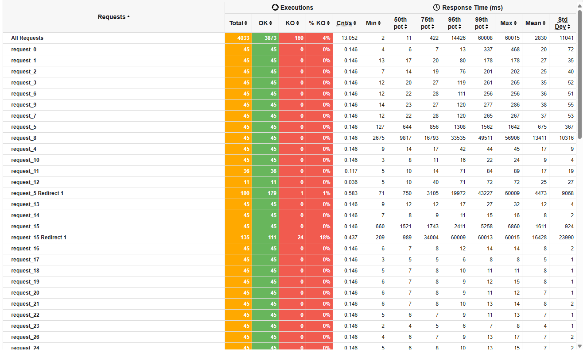
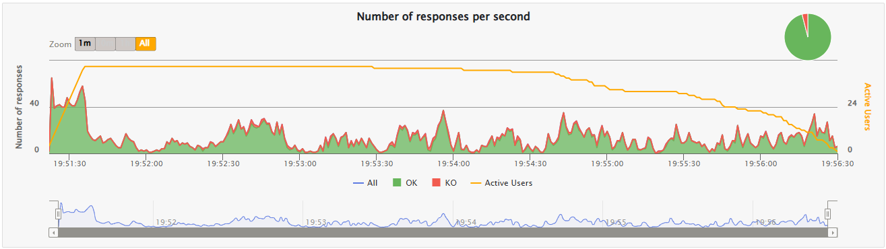

*Reiniciar una partida empezada, y una vez reiniciada, acabar la nueva partida*

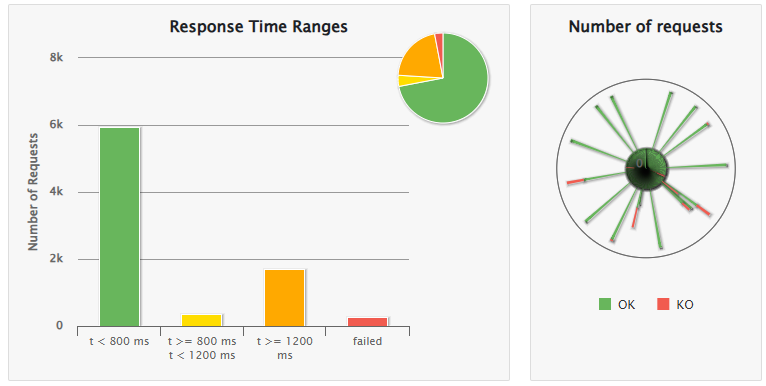
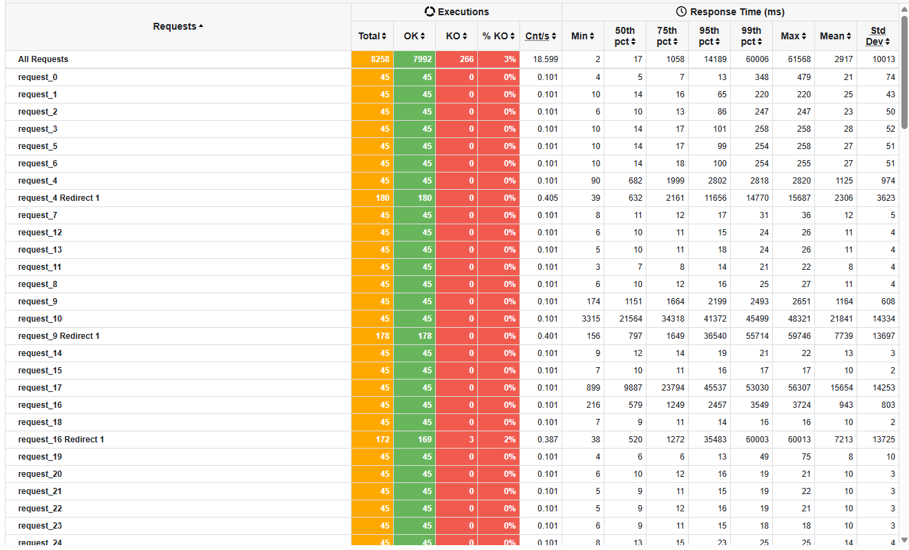
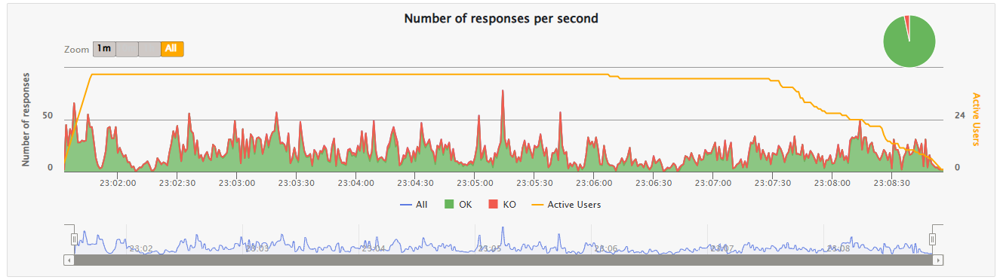

==== Pruebas de estrés
También se han realizado pruebas de estrés a la aplicación. Estas pruebas se encargan de medir el rendimiento de la aplicación bajo condiciones extremas más allá de patrones normales. En este caso, se han realizado pruebas de estrés para medir el rendimiento de la aplicación en cuanto a la cantidad de usuarios concurrentes que pueden interactuar con ella al mismo tiempo. Para ello, se compararán los resultados obtenidos en cada uno de los escenarios con la simulación más compleja y que más cuesta al sistema realizar, qué es el *flujo de jugar una partida usando el chatbot para obtener pistas*. Así obtendremos una evolución de la carga del sistema en función de la cantidad de usuarios concurrentes que interactúan con él al mismo tiempo. Usaremos el gráfico general de rangos de timepo de respuesta.

Para estas pruebas se han establecido los escenarios siguientes:

* **Escenario 1:** 3 usuarios por segundo, de forma constante, durante 15 segundos. Escenario anterior. (45 usuarios totales)

* **Escenario 2:** 75 usuarios totales, inyectados de forma progresiva durante 15 segundos.

* **Escenario 3:** 10 usuarios por segundo, de forma constante, durante 15 segundos. (150 usuarios totales)

* **Escenario 4:** 50 usuarios por segundo, de forma constante, durante 15 segundos. (750 usuarios totales)

* **Escenario 5:** 100 usuarios por segundo, de forma constante, durante 15 segundos. (1500 usuarios totales)

===== Escenario 1: 3 usuarios por segundo, de forma constante, durante 15 segundos. (45 usuarios totales)
Este escenario es el mismo que el de las pruebas de carga. Se han obtenido los mismos resultados que en las pruebas de carga, por lo que no se repiten aquí.

===== Escenario 2: 75 usuarios totales, inyectados de forma progresiva durante 15 segundos.

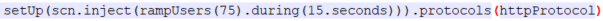

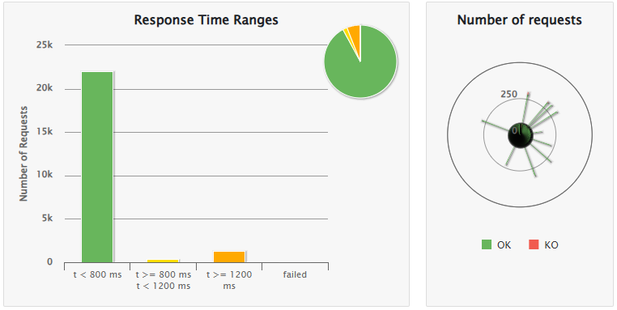

===== Escenario 3: 10 usuarios por segundo, de forma constante, durante 15 segundos. (150 usuarios totales)

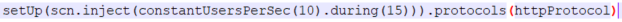

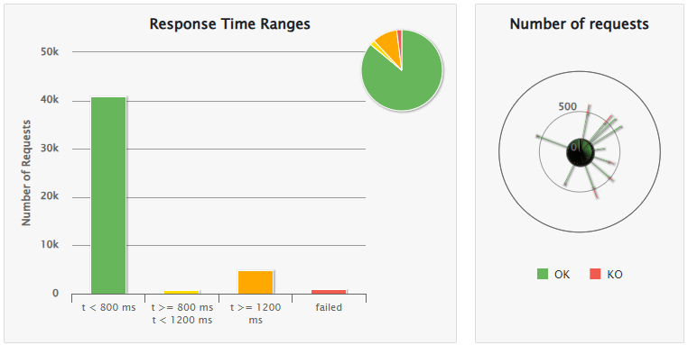

===== Escenario 4: 50 usuarios por segundo, de forma constante, durante 15 segundos. (750 usuarios totales)

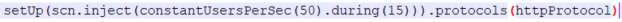

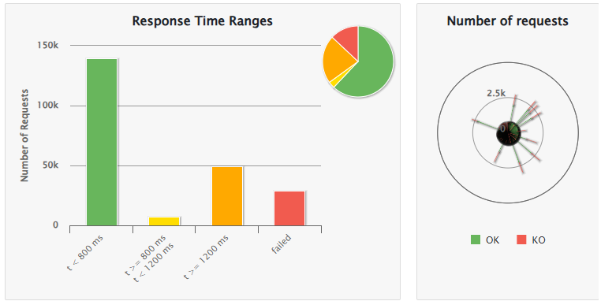

===== Escenario 5: 100 usuarios por segundo, de forma constante, durante 15 segundos. (1500 usuarios totales)

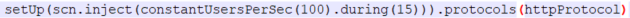

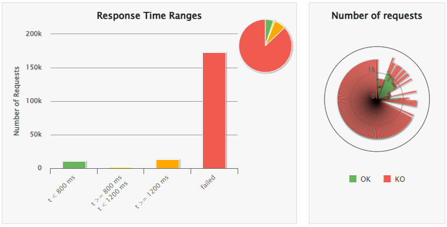

*Conclusiones de las pruebas de carga y estrés*

Las pruebas de carga y estrés realizadas a la aplicación han demostrado que la aplicación es capaz de soportar una gran cantidad de usuarios concurrentes sin problemas de rendimiento. La aplicación ha demostrado ser capaz de manejar hasta 150 usuarios concurrentes con un 86% de las peticiones en un tiempo inferior a 800 ms, aunque a partir de 750 usuarios se empiezan a notar algunos problemas de rendimiento ya que baja al 62%. A partir de 1500 usuarios, la aplicación empieza a tener problemas de rendimiento y no es capaz de manejar todos los usuarios concurrentes.