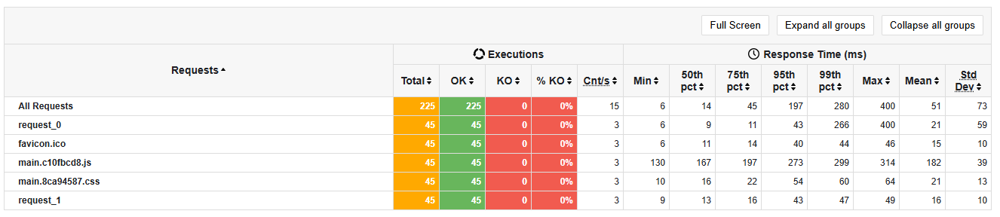

ifndef::imagesdir[:imagesdir: ../images]

[[section-tests]]

== Tests

=== Pruebas de carga (load tests)

Se han realizado pruebas de carga a la aplicación. Estas pruebas se encargan de medir el rendimiento de la aplicación bajo condiciones específicas. En este caso, se han realizado pruebas de carga para medir el rendimiento de la aplicación en cuanto a la cantidad de usuarios concurrentes que pueden interactuar con ella al mismo tiempo.

Para las primeras pruebas se ha establecido el escenario de *3 usuarios por segundo, de forma constante, durante 15 segundos*, un total de 45 usuarios.

image::../images/12_load-tests_3usersper15seg.png[]

Para este escenario, se han obtenido los siguientes resultados en los diferentes flujos de la aplicación.

*Cargar la aplicación*

image::../images/12_load_tests_3usersper15seg_loadapp.png[]

*Navegar por la aplicación*

image::../images/12_load_tests_3usersper15seg_navigate.png[]
image::../images/12_load_tests_3usersper15seg_navigate2.png[]

*Iniciar sesión en la aplicación*

image::../images/12_load_tests_3usersper15seg_login.png[]
image::../images/12_load_tests_3usersper15seg_login2.png[]

*Registrarse como nuevo usuario en la aplicación*

image::../images/12_load_tests_3usersper15seg_register.png[]
image::../images/12_load_tests_3usersper15seg_register2.png[]

*Jugar una nueva partida completa*

image::../images/12_load_tests_3usersper15seg_playnewgame.png[]
image::../images/12_load_tests_3usersper15seg_playnewgame2.png[]
image::../images/12_load_tests_3usersper15seg_playnewgame3.png[]

*Jugar una nueva partida usando el chatbot para obtener pistas*

image::../images/12_load_tests_3usersper15seg_playnewgameusingllm.png[]
image::../images/12_load_tests_3usersper15seg_playnewgameusingllm2.png[]
image::../images/12_load_tests_3usersper15seg_playnewgameusingllm3.png[]

*Abandonar una partida ya iniciada*

image::../images/12_load_tests_3usersper15seg_notfinishedgame.png[]
image::../images/12_load_tests_3usersper15seg_notfinishedgame2.png[]
image::../images/12_load_tests_3usersper15seg_notfinishedgame3.png[]

*Reiniciar una partida empezada, y una vez reiniciada, acabar la nueva partida*

image::../images/12_load_tests_3usersper15seg_restartgame.png[]
image::../images/12_load_tests_3usersper15seg_restartgame2.png[]
image::../images/12_load_tests_3usersper15seg_restartgame3.png[]

